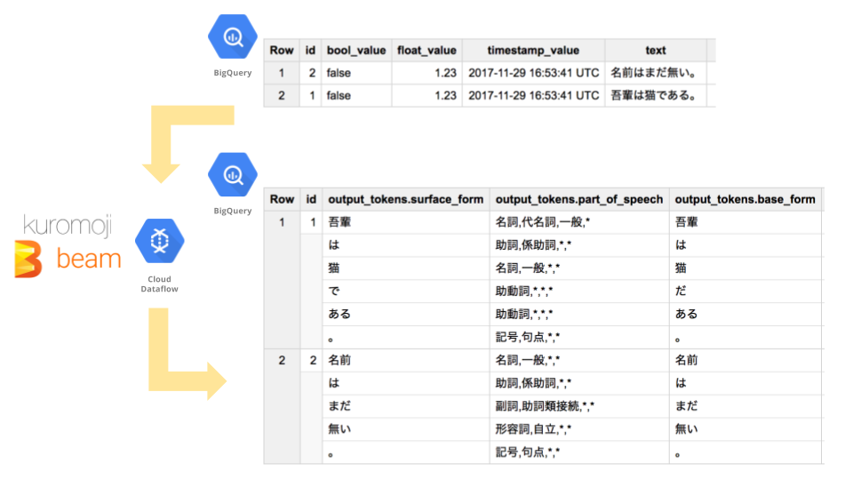

# kuromoji-for-bigquery

[](https://travis-ci.org/yu-iskw/kuromoji-for-bigquery)

`kuromoji-for-bigquery` tokenizes text on a BigQuery table with kuromoji and apache beam.
And then the tokenized result will be stored into another BigQuery table.

It is horizontally-scalable on top of distributed system, since apache beam can run on Google Dataflow, Apache Spark, Apache Flink and so on.



## Requirements

- Maven
- Java 1.8+
- Google Cloud Platform account

## Version Info

- Apache Beam: 2.34.0
- Kuromoji: 0.7.7

## How to Use

### Command Line Options

#### Required Options
- `--project`: Google Cloud Project
- `--inputDataset`: Input BigQuery dataset ID
- `--inputTable`: Input BigQuery table ID
- `--tokenizedColumn`: Column name to tokenize in a input table
- `--outputDataset`: Output BigQuery dataset ID
- `--outputTable`: Output BigQuery table ID
- `--schema`: BigQuery schema to select columns in a input table. (Format: `id:integer,name:string,value:float,ts:timestamp`)
- `--tempLocation`: The Cloud Storage path to use for temporary files. Must be a valid Cloud Storage URL, beginning with `gs://`.
- `--gcpTempLocation`: A GCS path for storing temporary files in GCP.

#### Optional Options
- `--outputColumn`: Output column for tokenized result in output table. (Default: `token`)
- `--kuromojiMode`: Kuromoji Mode. (`NORMAL`, `SEARCH`, or `EXTENDED`) (Default: `NORMAL`)
- `--createDisposition`: Create Disposition option for BigQuery. (`CREATE_NEVER` or `CREATE_IF_NEEDED`)
- `--writeDisposition`: Write Disposition option for BigQuery. (`WRITE_TRUNCATE`, `WRITE_APPEND` or `WRITE_EMPTY`)
- `--runner`: Apache Beam runner.
  - When you don't set this option, it will run on your local machine, not Google Dataflow.
  - e.g. `DataflowRunner`
- `--numWorkers`: The number of workers when you run it on top of Google Dataflow.
- `--workerMachineType`: Google Dataflow worker instance type
  - e.g. `n1-standard-1`, `n1-standard-4`

## Run the command

```
# compile
mvn clean package

# Run bigquery-to-datastore via the compiled JAR file
java -jar $(pwd)/target/kuromoji-for-bigquery-bundled-0.2.2.jar \
  --project=test-project-id \
  --schema=id:integer \
  --inputDataset=test_input_dataset \
  --inputTable=test_input_table \
  --outputDataset=test_output_dataset \
  --outputTable=test_output_table \
  --tokenizedColumn=text \
  --outputColumn=token \
  --kuromojiMode=NORMAL \
  --tempLocation=gs://test_yu/test-log/ \
  --gcpTempLocation=gs://test_yu/test-log/ \
  --maxNumWorkers=10 \
  --workerMachineType=n1-standard-2
```

## Versions
| kuromoji-for-bigquery | Apache Beam | kuromoji |
| --------------------- | ----------- | -------- |
| 0.1.0                 | 2.1.0       | 0.7.7    |
| 0.2.x                 | 2.20.0      | 0.7.7    |
| 0.3.x                 | 2.34.0      | 0.7.7    |

## License

Copyright (c) 2017 Yu Ishikawa.
